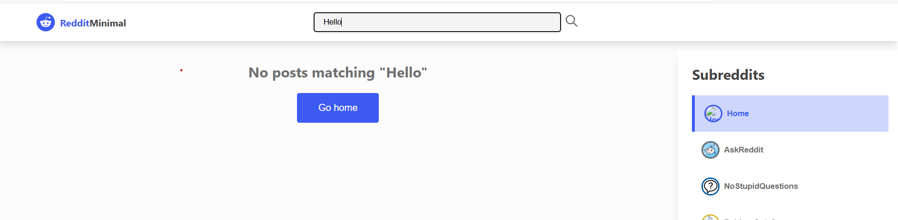

# Introduction
This project uses React to create reddit client app. 

## Table of content
- Technologies
- Project structure
- Getting started

## Technologies 
- React

## Project structure
```
.
└───REDDIT-CLIENT-CLONE
    └───src
        └───api
        └───components
        └───features
        └───store
        └───utils
    └───App.css
    └───App.js
    └───index.js
    └───index.css
    └───README.md
```
## Getting started
Setting node version: ```nvm use 16.```

Clone the respository from github: ```git clone```


